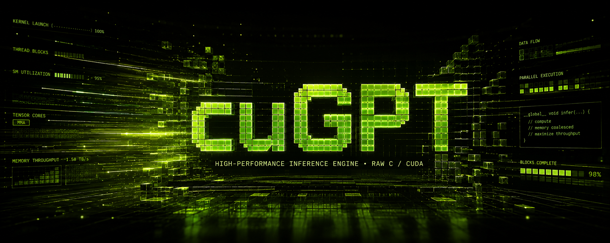

<p align="center">
  
</p>

# **cuGPT**

Inference engine on GPT-2 (124M) model, in raw C/CUDA. Currently being tested for NVIDIA Tesla T4.

# **Project Goal**

Build GPT-2 inference avoiding existing frameworks.

Constraints:
* Raw C and CUDA kernels
* First readibility and maintainability, second optimization
* Building from bottom to top: Kernels and Functions -> Layer -> Transformer
* Current approach set to first independently validate kernels, then combine.

The goal is understanding design considerations rather than reproducing existing engines.

# **Current Status**

## **Implemented**

- [x] Layernorm 
- [x] FeedForward Neural Network
- [x] Token Embedding + Positional Embedding
- [x] Language Model Head
- [x] Online Softmax (with TOP-K) **NOT TESTED**
- [x] Logits Sampler **NOT TESTED**

## **In Progress**

- [ ] Flash Attention + Causal Mask
- [ ] Parameter Loading
- [ ] Tensor Parameter Adressing
- [ ] **Main Inference Loop**

# **Quick Start**

**Current development is concentrated at the layer level. E.g., to test a single layer:**

```
git clone https://github.com/borymory/cuGPT.git
```

```
cd cuGPT

chmod +x scripts/test_layer.sh

./scripts/test_layer.sh layernorm
```

# **Roadmap**

Inference:

- [ ] GPT-2 forward pass
    - [ ] KV-cache

Future Direction:

* Training
* Modular tensor parameters and transformer model using struct logic
* Python wrapper for readibility

## **Notes**

Development notes and research live in /research.